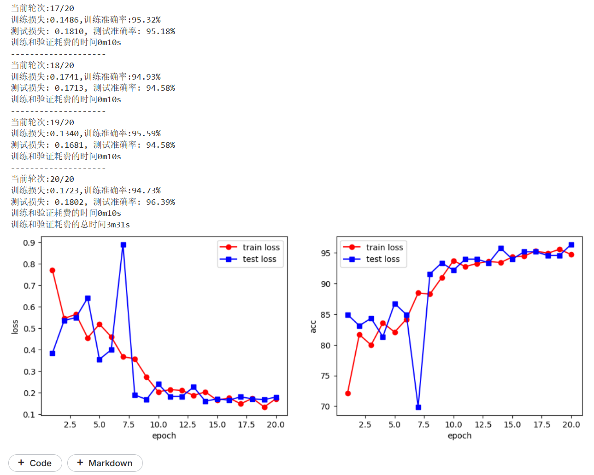
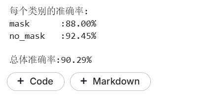
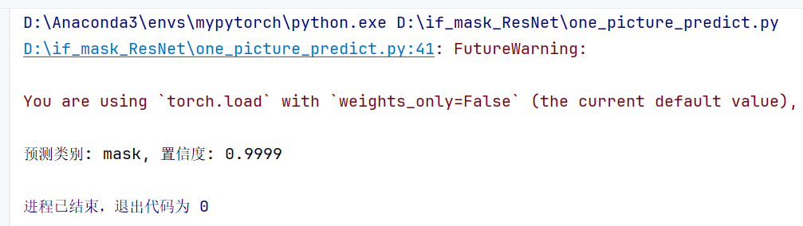
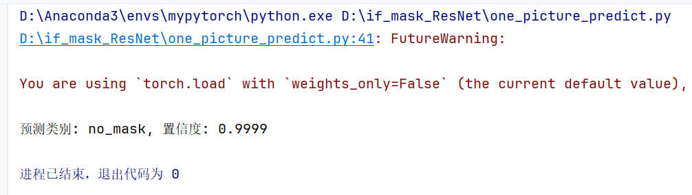

# 项目名：基于PyTroch+ResNet18的是否佩戴口罩识别


## 训练结果

训练的主脚本是`train_ResNet.py`

我们使用kaggle的免费GPU资源进行训练，上传了数据集，运行后，获得了`best_model.pth`，并且输出如下训练过程图(部分截图)




kaggle的notebook地址（已公开）:https://www.kaggle.com/code/hideself/fruits-classify-googlenet-train


## 测试结果

训练的主脚本是`test_ResNet.py`

我们使用kaggle的免费GPU资源进行训练，上传了数据集和刚刚获得的模型参数`best_model.pth`，验证结果如下




kaggle的notebook地址（已公开）:https://www.kaggle.com/code/hideself/if-mask-resnet18-test


## 使用说明（单张图预测）

单张图预测脚本是`one_picture_predict.py`


将待预测图片放入`./image_for_test`文件夹中。


接着把待预测图片名字填入`one_picture_predict.py`中

```python
# 待预测图片是 './image_for_test/has_mask.jfif'
predicted_class, confidence = predict_single_image(model, './image_for_test/has_mask.jfif', test_transform, device)
```


之后运行`one_picture_predict.py`，就能得到运行结果。


### 单张图预测1：有口罩的


结果截图：




### 单张图预测2：无口罩的


结果截图：




## 模型与模型参数说明：

`./ResNet_model.py`是构建好的ResNet模型。

`./best_model.pth`是根据ResNet模型训练好得到的模型参数。


## 本作者的其他项目链接：

基于PyTroch+GoogLeNet的水果分类：https://github.com/hide-self/Fruits_Classify

基于PyTroch+GoogLeNet的猫狗识别：https://github.com/hide-self/Cat_Dog_Classify

基于NLP、爬虫、Django的微博舆情分析：https://github.com/hide-self/NLP_Public_Option_all

基于Vue前端的一个医院挂号系统完整网站：https://github.com/hide-self/Hospital_registration

基于html、css的web前端电商平台网站“云裳集”：https://github.com/hide-self/CloudLoomMall


## 本作者的邮箱联系方式：

商务合作与工作邀请请投递：

17751471191@163.com